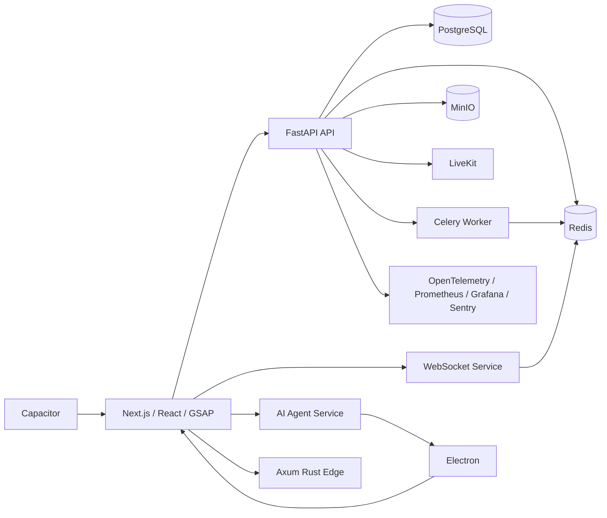

<div align="center">

# Hello World

### Full-stack animation UI and AI-native application template

Build a polished SaaS starter that can ship to web, iOS, Android, macOS, and Windows while keeping backend, realtime, queue, AI Agent, Rust edge, and observability foundations ready from day one.


[Quick start](#quick-start) • [Features](#features) • [Architecture](#architecture) • [Documentation](#documentation) • [Template usage](#use-this-as-a-template)

</div>

---

> Screenshot placeholder: add `docs/hello-world-screenshot.png` manually when you are ready to publish visual assets.

## Why this template?

Most starters cover one surface: a web app, an API, or a mobile shell. **Hello World** is a template for teams that want a more realistic product foundation:

- **Modern animation UI** with Next.js, React, TypeScript, Tailwind CSS, and GSAP.
- **SaaS backend core** with FastAPI, PostgreSQL, Redis, MinIO, authentication hooks, and metrics.
- **Realtime collaboration** with WebSocket, Redis Pub/Sub, WebRTC-ready LiveKit rooms, and queue-backed background work.
- **AI-native extension points** with an Agent service, auditable desktop automation intents, durable storage, realtime progress, and observability.
- **Native delivery paths** through Capacitor for mobile and Electron for desktop.
- **High-performance escape hatch** through Axum/Rust for latency-sensitive workloads.

The repository is intentionally a **template**, not a single-purpose app. Keep the modules you need, remove what you do not, and use the docs as a blueprint for production hardening.

## Features

| Area | Included |
| --- | --- |
| Web app | Next.js App Router, React, TypeScript, Tailwind CSS, Zustand, TanStack Query, Auth.js route scaffold, GSAP animation system |
| Motion system | Scoped `@gsap/react` timelines, ScrollTrigger rail animation, transform/opacity reveals, reduced-motion fallback, Microck `gsap-skills`-inspired patterns |
| Mobile | Capacitor shell for iOS and Android, dev-server handoff to local Next.js, production `webDir` path |
| Desktop | Electron shell for macOS and Windows, context-isolated preload bridge, automation intent IPC placeholder |
| Backend API | FastAPI routers for hello, auth placeholder, PostgreSQL visits, MinIO uploads, Celery queue enqueueing, LiveKit tokens, observability |
| Data layer | PostgreSQL durable store, Redis cache/queue/PubSub, MinIO S3-compatible object storage |
| Realtime | WebSocket service with Redis Pub/Sub fanout, LiveKit/WebRTC-ready token endpoint |
| Jobs | Celery task worker using Redis as broker/result backend pattern |
| Rust edge | Axum/Tokio service with health and hello endpoints plus Rust integration tests |
| AI Agent | Dedicated FastAPI service for agent planning and auditable desktop automation command intents |
| Monitoring | OpenTelemetry hooks, Prometheus scrape config, Grafana datasource provisioning, Sentry DSN support |
| Docs | MkDocs Material site with template guide, architecture, app/service/infra docs, operations, references, and ADRs |

## Tech stack

```text
Frontend     Next.js, React, TypeScript, Zustand, TanStack Query, GSAP, Tailwind CSS, Auth.js
Native       Capacitor, Electron
Backend      FastAPI, Python, PostgreSQL, Redis, MinIO
Realtime     WebRTC, LiveKit, WebSocket, Redis Pub/Sub
Jobs         Celery / RQ pattern, Redis Queue
Performance  Axum / Rust
Monitoring   OpenTelemetry, Prometheus, Grafana, Sentry
AI-native    Agent service, desktop automation intent boundary
```

## Quick start

```bash
cp .env.example .env
npm install
python -m pip install -r requirements-dev.txt
npm run dev:infra
npm run dev:api
npm run dev:realtime
npm run dev:worker
npm run dev:agent
npm run dev:web
npm run dev:desktop
npm run dev:rust
```

Open the main surfaces:

| Surface | URL |
| --- | --- |
| Web app | <http://localhost:3000> |
| FastAPI | <http://localhost:8000> |
| Realtime WebSocket | `ws://localhost:8010/ws` |
| AI Agent | <http://localhost:8020> |
| Rust edge | <http://localhost:8081> |
| MinIO Console | <http://localhost:9001> |
| LiveKit | `ws://localhost:7880` |
| Prometheus | <http://localhost:9090> |
| Grafana | <http://localhost:3001> |

## Project structure

```text
apps/
├── web/          Next.js animated web app and admin surface
├── mobile/       Capacitor iOS / Android shell
└── desktop/      Electron macOS / Windows shell
services/
├── api/          FastAPI SaaS backend
├── realtime/     WebSocket + Redis Pub/Sub service
├── worker/       Celery Redis queue worker
├── rust-edge/    Axum high-performance Rust service
└── agent/        AI Agent + desktop automation intent service
infra/            Docker Compose infrastructure for local development
docs/             MkDocs template documentation site
```

## Architecture



Read the full architecture guide in [`docs/architecture.md`](docs/architecture.md).

## Documentation

| Guide | Purpose |
| --- | --- |
| [`docs/index.md`](docs/index.md) | Documentation home and template overview |
| [`docs/template-usage.md`](docs/template-usage.md) | How to use this repository as a template |
| [`docs/project-structure.md`](docs/project-structure.md) | Directory-by-directory ownership map |
| [`docs/technology-selection.md`](docs/technology-selection.md) | Why every technology was selected |
| [`docs/development.md`](docs/development.md) | Local development workflow |
| [`docs/testing.md`](docs/testing.md) | Test matrix and commands |
| [`docs/deployment.md`](docs/deployment.md) | Deployment and production hardening guide |
| [`docs/animation/gsap.md`](docs/animation/gsap.md) | GSAP animation system and checklist |
| [`docs/ai-native/agent-architecture.md`](docs/ai-native/agent-architecture.md) | Agent architecture and extension path |
| [`docs/ai-native/desktop-automation-safety.md`](docs/ai-native/desktop-automation-safety.md) | Automation safety model |

Preview docs locally:

```bash
python -m pip install -r docs/requirements.txt
mkdocs serve
```

## Available scripts

| Command | What it does |
| --- | --- |
| `npm run dev:web` | Start the Next.js web app |
| `npm run dev:api` | Start FastAPI on port 8000 |
| `npm run dev:realtime` | Start WebSocket service on port 8010 |
| `npm run dev:worker` | Start Celery worker |
| `npm run dev:agent` | Start AI Agent service on port 8020 |
| `npm run dev:rust` | Start Axum/Rust service |
| `npm run dev:infra` | Start PostgreSQL, Redis, MinIO, LiveKit, Prometheus, and Grafana |
| `npm run test:web` | Run web unit tests, typecheck, and Next.js build |
| `npm run test:python` | Run Python service tests |
| `npm run test:rust` | Run Rust tests |
| `npm run test` | Run the full test suite |
| `npm run test:docs` | Build MkDocs in strict mode |

## Use this as a template

1. Click **Use this template** on GitHub or clone this repository.
2. Rename package names, app IDs, service titles, and domains.
3. Copy `.env.example` to `.env` and replace all local defaults.
4. Start with the MVP modules: `apps/web`, `services/api`, PostgreSQL, Redis, GSAP, Capacitor, and Electron.
5. Add enhancement modules when needed: MinIO, WebSocket, Celery/RQ, LiveKit, and monitoring.
6. Add advanced modules last: Axum/Rust, AI Agent workflows, and desktop automation adapters.
7. Delete modules you do not need and remove their scripts/docs from navigation.

See [`docs/template-usage.md`](docs/template-usage.md) for the detailed checklist.

## Roadmap

- **Phase 1 — MVP:** web app, API, PostgreSQL, Redis, GSAP dashboard, mobile shell, desktop shell.
- **Phase 2 — Collaboration:** MinIO files, WebSocket fanout, queue workers, LiveKit rooms, dashboards.
- **Phase 3 — AI-native:** agent memory, tool execution, automation approvals, Rust hot paths, production telemetry.

## Contributing

This is a template repository. Contributions should keep the starter understandable, documented, and easy to remove or extend. Before opening a PR, run:

```bash
npm run test
```

## License

No license file is currently included. Add the license that matches your organization before publishing a derived project.
