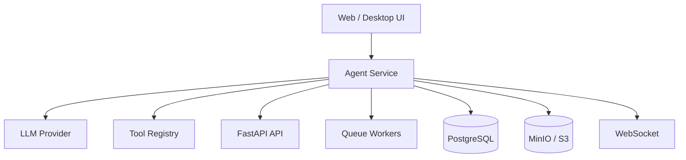

# AI Agent Architecture

The agent layer is intentionally separate from the main API so AI workflows can evolve without overloading the SaaS request/response boundary.

## Current design

`services/agent` exposes:

- `POST /agent/hello`: accepts a goal and returns a plan.
- `GET /automation/capabilities`: describes supported automation command intents.
- `POST /automation/command`: accepts an auditable automation intent.

## Recommended production architecture

## Agent responsibilities

- Interpret user goals.
- Plan steps.
- Ask for approval when actions are sensitive.
- Call product APIs and tool adapters.
- Queue long-running work.
- Stream progress.
- Persist memory and audit trails.

## What not to put in the agent

Avoid making the agent service own core product data models. Product truth should stay in PostgreSQL behind the main API. The agent can request actions, but the application should enforce permissions and invariants.

## Extension checklist

- Add an LLM provider abstraction.
- Add a tool registry with per-tool schemas.
- Add user/workspace permissions.
- Store agent runs, steps, tool calls, and approvals.
- Stream progress through the realtime service.
- Send long-running tasks to workers.
- Store generated artifacts in object storage.
- Add cost, latency, and error telemetry.
