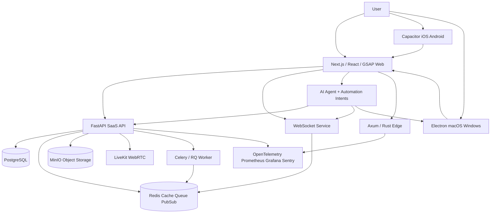

# Architecture Notes

The template is split by runtime so each technology has a clear owner and can scale independently.

## Runtime ownership

- **Next.js** renders the public web app and admin console.
- **React** owns component composition for dashboard cards, realtime panels, and interactive controls.
- **TypeScript** keeps frontend contracts explicit.
- **Zustand** stores local UI state, while **TanStack Query** caches server data and powers mutations.
- **GSAP** is initialized through `@gsap/react` with scoped timelines, ScrollTrigger, transform/opacity animation, staggered reveals, and reduced-motion support inspired by the downloaded `Microck/gsap-skills` guidance.
- **Tailwind CSS** supplies fast, token-like utility styling for responsive UI composition.
- **Auth.js** provides the authentication integration point for login/session flows.
- **FastAPI** owns product APIs, PostgreSQL persistence, Redis caching, queue triggers, MinIO file storage, LiveKit token generation, metrics, OpenTelemetry, and Sentry setup.
- **PostgreSQL** is the source of truth for durable product data.
- **Redis** is used for cache, queue broker, and Pub/Sub.
- **MinIO** stores user files and generated artifacts behind an S3-compatible local API.
- **WebSocket + Redis Pub/Sub** demonstrate realtime fanout.
- **Celery/RQ** demonstrates background jobs through Redis.
- **LiveKit/WebRTC** provides the path for audio/video, screen sharing, and collaborative AI rooms.
- **Axum/Rust** provides a high-performance service for latency-sensitive workloads.
- **Electron** and **Capacitor** wrap the web application for desktop and mobile delivery.
- **OpenTelemetry, Prometheus, Grafana, and Sentry** provide trace, metric, dashboard, and error-reporting foundations.

## Hello World data flow

1. The user opens `apps/web` in a browser, Capacitor shell, or Electron shell.
2. The page animates with GSAP and reads local UI state from Zustand.
3. TanStack Query requests `/hello` from FastAPI.
4. FastAPI caches the payload in Redis and returns stack metadata.
5. The UI can create a PostgreSQL visit, enqueue a Celery job, request a LiveKit token, call the AI Agent service, and queue a desktop automation intent.
6. The realtime service accepts WebSocket messages and can broadcast over Redis Pub/Sub.
7. Prometheus and Grafana are available for metrics, and Sentry/OpenTelemetry hooks are represented in backend configuration.

## Advanced AI and automation layer

`services/agent` models the third-stage AI Agent and desktop automation capabilities. It exposes auditable command intents for screen capture, mouse movement, mouse clicks, and keyboard typing. The Electron shell exposes a preload bridge and IPC handlers so native desktop adapters can later execute these commands safely behind explicit user controls.

The architecture deliberately keeps automation as **intent first, execution second**. This keeps the API auditable, lets the UI display pending actions, and makes it easier to add permission prompts, allowlists, rate limits, and replay-safe logs before native execution is enabled.

## PostgreSQL usage

The FastAPI lifespan hook creates the `hello_visits` table on startup. The `/database/hello` endpoints persist and list Hello World visits so the scaffold demonstrates real database usage instead of only configuration.
